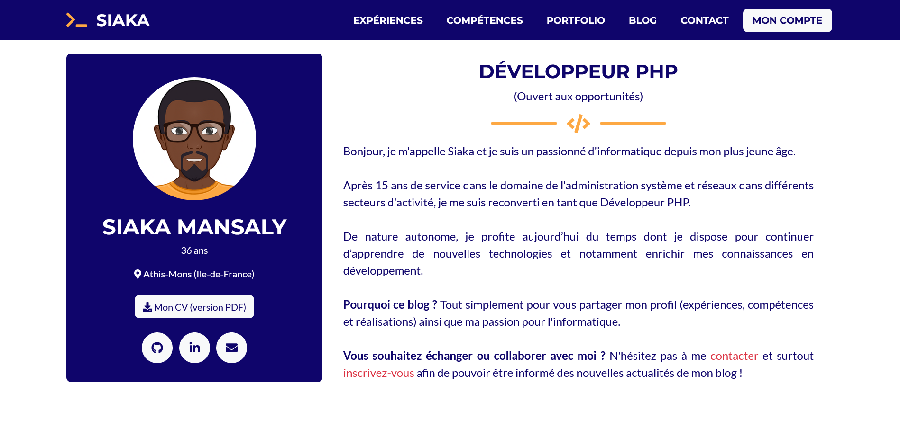

<div id="top"></div>

<!-- PROJECT LOGO -->
<br />
<div align="center">
  <a href="https://github.com/siakamansaly/Blog_PHP_MVC">
    
  </a>
  <h1 align="center">Blog PHP MVC</h1>
  <p align="center">
    My first blog in PHP
  </p>
</div>

<!-- ABOUT THE PROJECT -->
## About The Project

<div align="center">
    
</div>
<p>The goal of this project is to create a blog in my colors to show my talents as PHP developer.
This project carried out in PHP, OOP and adopts an MVC architecture. It is also necessary to respect PSRs and ensure that there are no security breaches. (Code quality monitoring on Codacy or SymfonyInsight)</p>
<p>The project contains:</p>
<ul>
  <li>a connection and registration system</li>
  <li>a frontend part with my presentation as well as all my articles</li>
  <li>a part allowing users to comment on an article</li>
  <li>a backend part to manage articles, comments and users.</li>
</ul>

<p align="right">(<a href="#top">back to top</a>)</p>

### Built With

This section should list any major frameworks/libraries used to bootstrap your project. Leave any add-ons/plugins for the acknowledgements section. Here are a few examples.
<ul>
  <li><a href="https://www.php.net/" target="_blank">PHP</a></li>
  <li><a href="https://getbootstrap.com/" target="_blank">Bootstrap</a></li>
  <li><a href="https://startbootstrap.com/" target="_blank">StartBootstrap (template)</a></li>
  <li><a href="https://jquery.com" target="_blank">JQuery</a></li>
  <li><a href="https://twig.symfony.com/" target="_blank">Twig</a></li>
  <li><a href="https://symfony.com/doc/current/components/http_foundation.html" target="_blank">HTTPFoundation</a></li>
  <li><a href="https://github.com/PHPMailer/PHPMailer" target="_blank">PHPMailer</a></li>
  <li><a href="https://github.com/cocur/slugify" target="_blank">Slugify</a></li>
  <li><a href="http://altorouter.com/" target="_blank">Altorouter</a></li>
  <li><a href="https://github.com/vlucas/phpdotenv" target="_blank">PHPdotenv</a></li>
  <li><a href="https://github.com/filp/whoops" target="_blank">Whoops</a></li>
</ul>

<p align="right">(<a href="#top">back to top</a>)</p>

<!-- GETTING STARTED -->
## Getting Started

This is an example of how you may give instructions on setting up your project locally.
To get a local copy up and running follow these simple example steps.

1.Clone the repo
   ```sh
   git clone https://github.com/siakamansaly/Maquette_HTML_CSS.git
   ```
2.Install composer packages
   ```sh
   composer install
   ```

<p align="right">(<a href="#top">back to top</a>)</p>

<!-- CONTACT -->
## Contact

Siaka MANSALY - [@your_twitter](https://twitter.com/your_username) - siaka.mansaly@gmail.com

Project Link: [https://github.com/siakamansaly/Blog_PHP_MVC](https://github.com/siakamansaly/Blog_PHP_MVC)

<p align="right">(<a href="#top">back to top</a>)</p>